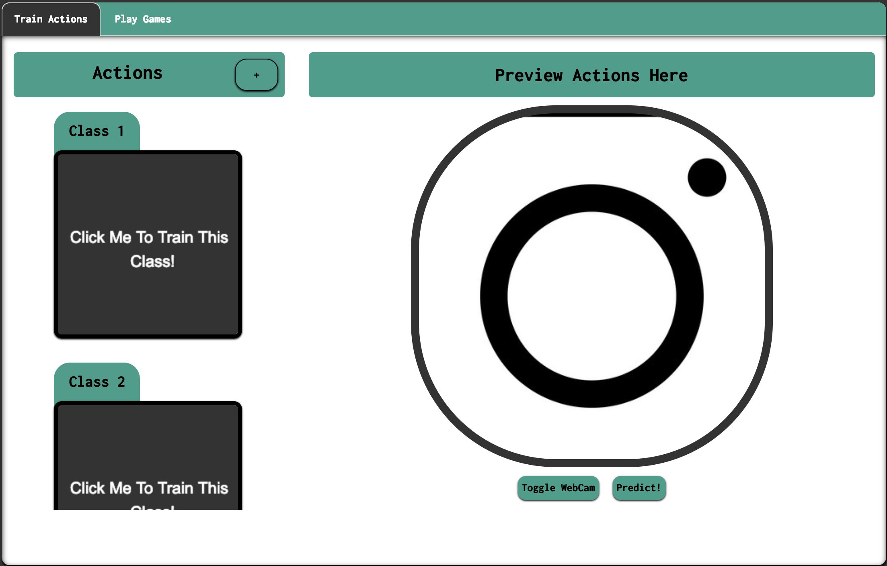

## BudgetKinect

A platform created using TF.js to use gestures to control aspects of the browser. 
Uses transfer learning on MobilNet models to be efficient on low powered devices.

Use built-in webcam to train actions. Actions take very fast to train as a pretrained model (a variation of resnet to be low power) is used for getting the embeddings to classfiy the image. Once the classes are trained, they can be associated with any  browser action to perform it. As a proof of concept we use it to play games. 

<b>Steps to run:</b>
<ul>
<li>npm install</li>
<li>npm run-script build</li>
<li>npm start</li>
</ul>
